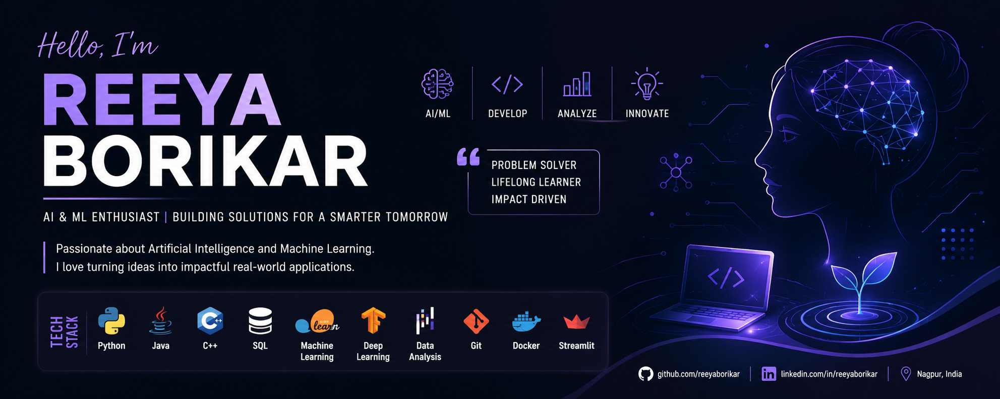

# 👋 Hello, I'm Reeya Borikar

### AI & ML Engineer | Generative AI Developer | Full-Stack Developer | DevOps Learner

---

# 🚀 About Me

🎓 B.Tech Student in Artificial Intelligence & Machine Learning

🤖 Passionate about Artificial Intelligence, Machine Learning, and Generative AI

💡 Building intelligent AI applications using LLMs, RAG, LangChain, LangGraph, and Python

🌐 Interested in Full-Stack Development, Cloud Computing, and DevOps

🔍 Experienced in developing AI-powered automation and data-driven solutions

📚 Currently Learning

- Docker
- Kubernetes
- Jenkins
- Terraform
- AWS Cloud
- CI/CD Pipelines
- Agentic AI
- Multi-Agent Systems

🎯 Goal: Build intelligent AI systems that solve real-world problems.

---

# 🌐 Connect With Me

---

# 💻 Tech Stack

## Programming Languages

---

## Artificial Intelligence

---

## Web Development

---

## Databases

---

## DevOps & Cloud

---

# 🚀 Featured Projects

## 🤖 HR Pulse AI

- AI-powered employee feedback platform
- Requirement Engineering Assistant
- Sentiment Analysis
- Interactive AI Dashboard
- LLM-powered insights

---

## 🩺 Sepsis Prediction System

- Machine Learning-based disease prediction
- CatBoost Classifier
- Real-time Prediction
- Streamlit Web App
- PostgreSQL Integration

---

## 📄 DocuTalk AI

- Chat with PDF Documents
- Retrieval Augmented Generation (RAG)
- LangChain
- FAISS Vector Database
- Google Gemini API

---

## 🚗 Vehicle Detection using YOLO

- YOLO Object Detection
- Computer Vision
- Autonomous Driving Research
- Real-time Detection

---

# 📜 Certifications

🏆 Artificial Intelligence Internship

🏆 Web Development Internship

🏆 Python Programming

🏆 Machine Learning

🏆 DevOps: Ultimate DevOps from Beginner to Advanced (In Progress)

---

# 📊 GitHub Statistics

---

# 🏆 GitHub Trophies

---

# 📈 Contribution Graph

---

# ✨ Motto

> **Code. Learn. Build. Repeat. 🚀**

> **Turning AI Ideas into Real-World Intelligent Solutions.**
